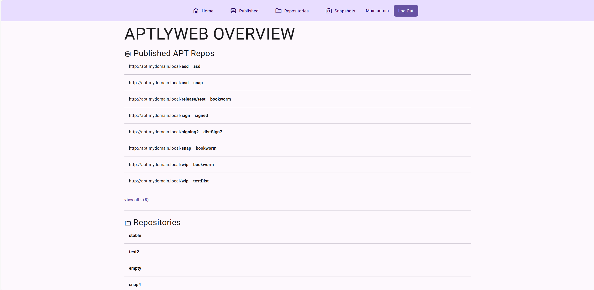

# AptlyWeb

AptlyWeb is an application to manage an [Aptly](https://www.aptly.info/) instance with a graphical interface in the browser.  

---
## Project Status

The application was initially developed as a student project. The required set of features is completed. We give no guarantees on updates in the future.

## Features

- Overview of all local repositories, published repositories and snapshots  
- Detailed view for local repositories, published repositories, snapshots and packages
- Create/edit/delete local repositories, published repositories and snapshots
- Upload .debs to repositories manually
- Supports http basic auth for the Aptly API



### System context

The AptlyWeb server sits between the user and the aptly server.


## Installation

**TODO**: use image hosted on github registry

> [!important]
> The Aptly server must be at least version 1.5.0

### Usage with docker compose

1. Create a `docker-compose.yml`
```yml
services:
  aptlyweb:
    image: aptlyweb # TODO
    env_file:
      - .env
    volumes:
      - ./data:/opt/aptlyweb/data
    # app is hosted on port 8001
    ports:
      - 8001:8001
```
2. Create the `.env` file, see `.env.example` or [settings below](#settings)
```sh
# URL under which the hosted APT repos will be available 
APTLY_URL=http://apt.mydomain.net
# URL where aptly REST API is reachable
APTLY_API_URL=http://apt.mydomain.net:8080

## Initial admin user
# CHANGE these values!
SUPER_USER_PASSWORD=admin
SUPER_USER_NAME=admin
SUPER_USER_EMAIL=admin@test.local
```

3. Run `docker compose up`
4. Goto to `<APTLY_URL>`
5. Goto to `<APTLY_URL>\admin` to create users

### Settings 

Avaible options via environment variables

| Name                    | Required | Value      | Description                                                                          |
| ----------------------- | -------- | ---------- | ------------------------------------------------------------------------------------ |
| APTLY_URL               | yes      |            | URL where the published repositories are accessible, including http(s) part          |
| APTLY_API_URL           | yes      |            | URL to the Aptly API, including http(s) part                                         |
| APTLY_API_SKIP_SSL      |          | TRUE/FALSE | Skip the certificate validation for the API (use with self signed certificates)      |
| APTLY_API_USERNAME      |          |            | HTTP Basic auth username for the Aptly API                                           |
| APTLY_API_PASSWORD      |          |            | HTTP Basic auth password for the Aptly API                                           |
| APTLY_API_PASSWORD_FILE |          |            | Path to file with HTTP Basic auth. Takes precedence over APTLY_API_PASSWORD password |
| SUPER_USER_NAME         | yes      |            | Username for the initial admin account                                               |
| SUPER_USER_PASSWORD     | yes      |            | Password for the initial admin account                                               |
| SUPER_USER_EMAIL        | yes      |            | E-Mail for the initial admin account                                                 |
| DEBUG                   |          | TRUE/FALSE | Enable django debug mode                                                             |
| DJANGO_SECRET           |          |            | Override the django secret, will be created automatically otherwise                  |


## Security

> [!important]
> We strongly advise against making AptlyWeb accessible to the internet. 

Unauthentificated users can see everything, but can not change anything. A simple user management using Django exists. 

### Permissions

We implement a basic permission system for all actions that change anything on the server.
The permission are assigned in Django admin area.

## Development

**Requirements**
- Docker & Docker Compose  
- Python 3.11+

